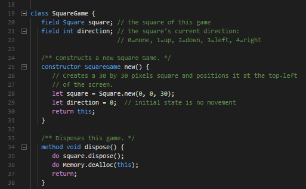

# Nand2Tetris - Jack Language Syntax Highlighting

## Features

Syntax highlighting for Jack language used in [Nand2Tetris part II](https://www.coursera.org/learn/nand2tetris2/) course at Coursera. 

The extension currently supports highlighting of:
- all language keywords
- quoted strings 
- comments. 
- type declarations (both keywords and classes)

Jack language is introduced in the 2nd part of the course. If you're taking the first part of the course - [Nand2Tetris part I](https://www.coursera.org/learn/build-a-computer), you should check out the HDL language syntax highlighting extension by Rob Lourens: [Nand2Tetris-HDL](https://marketplace.visualstudio.com/items?itemName=roblourens.vscode-nand2tetris-hdl).
## Requirements

n/a

## Extension Settings

n/a

## Known Issues

None

## Contributions

I am open to suggestions and pull requests [here](https://github.com/amadeann/nand2tetris-jack-syntax-vscode "Nand2Tetris - Jack Syntax Highlighting repoository on GitHub").

## Acknowledgements

I was inspired by the [Sublime Jack](https://github.com/swarn/sublime-jack) package.  

## Release Notes

### 0.0.1

Initial release of Jack Language Syntax Highlighting

### 0.0.1

Testing package update and adding the information about the GitHub repository